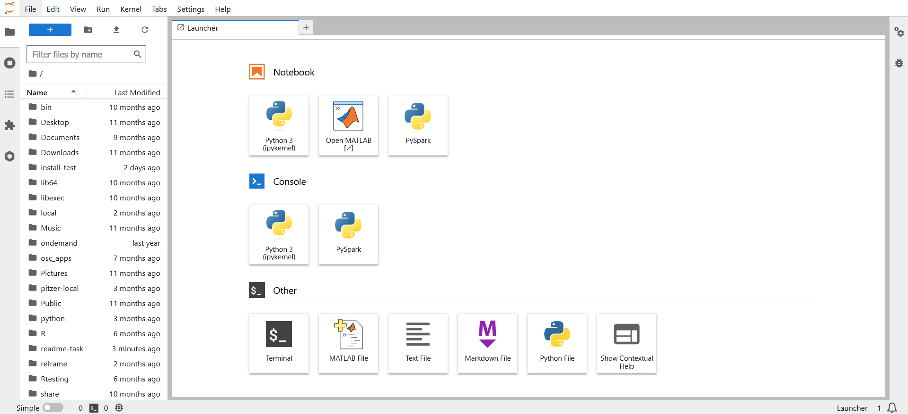
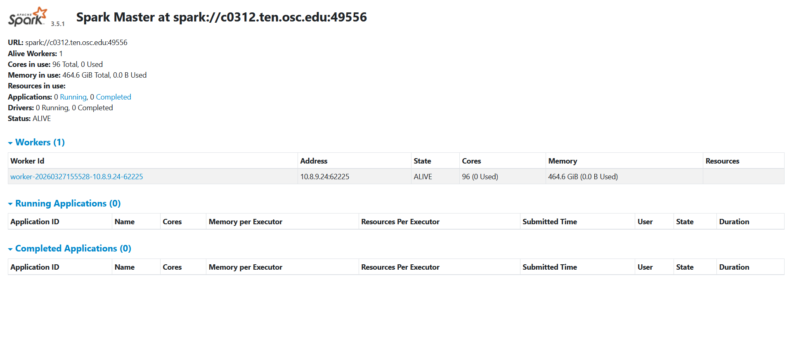

# Batch Connect - OSC Jupyter Notebook + Spark

## Overview


[](https://opensource.org/licenses/MIT)

Jupiter Notebook + Spark is an Open OnDemand Batch Connect app that launches a Jupyter Notebook server and an Apache Spark cluster as an interactive session on OSC HPC clusters. Jupyter provides free, open-standard web services for interactive computing across multiple programming languages. Spark is an open source cluster-computing framework.

This app uses the Batch Connect `basic` template with Slurm and supports
clusters: Ascend, Pitzer, and Cardinal.

- **Upstream project:** [Jupyter](https://jupyter.org/)
- **Batch Connect template:** `basic`
- **Scheduler:** Slurm

## Screenshots




## Features
- Launches either Jupyter Lab or Jupyter Notebook (user-selectable checkbox)
- Multi-cluster support (Ascend, Pitzer, Cardinal)
- Configurable cores, wall time, and node type (any or hugemem) via the launch form
- Root directory selector for the Jupyter session
- Spark configuration file selector
- Supplementary environment variables file selector for before starting the Spark cluster

## Requirements

### Compute Node Software
This Batch Connect app requires the following software be installed on the
**compute nodes** that the batch job is intended to run on (**NOT** the
OnDemand node):

- [Lmod] 6.0.1+ or any other `module purge` and `module load <modules>` based
  CLI used to load appropriate environments within the batch job before
  launching the Jupyter Notebook server.
- [Jupyter Notebook] 4.2.3+ (earlier versions are untested but may work for
  you)
- [OpenSSL] 1.0.1+ (used to hash the Jupyter Notebook server password)
- [Apache Spark] 2.1.0+

[Apache Spark]: https://spark.apache.org/
[Jupyter Notebook]: https://jupyter.org/
[OpenSSL]: https://www.openssl.org/
[Lmod]: https://www.tacc.utexas.edu/research-development/tacc-projects/lmod

### Open OnDemand

- Open OnDemand <!-- TODO: Minimum version? -->
- Slurm Scheduler

## App Installation

Please see the [References section](#software-installation) below for instructions on how to install the software that is launched by this App.

### 1. Clone the repository

```bash
# Batch Connect / Passenger apps:
cd /var/www/ood/apps/sys

# Widgets / Dashboards — check OOD docs for the correct path

git clone https://github.com/OSC/bc_osc_jupyter_spark.git
cd bc_osc_jupyter_spark

# Pin to a release (recommended)
git checkout v0.13.0
```
No restart is needed -- Batch Connect apps are not Passenger apps and are detected automatically.

### 2. Configure for your site

Edit `form.yml` and update these values for your cluster:

| Attribute | OSC Default | Change to |
|-----------|---------|-----------|
| `cluster` | `ascend`, `pitzer`, `cardinal` | Your cluster name(s) |
| `node_type` | `OSC-specific node types` | Node types available on your cluster |

### 3. Verify

No OOD restart is needed (Batch Connect apps are detected automatically). Visit your OOD dashboard and look for **Jupyter + Spark** under **Interactive Apps > Servers**.

## Configuration

### form.yml attributes

| Attribute | Description | Default |
|-----------|-------------|---------|
| `cluster` | Target cluster ID(s) | `ascend`, `pitzer`, `cardinal` |
| `jupyterlab_switch` | Toggle for launching LupyterLab vs. Notebook | `` |
| `working_dir` | Root directory for the Jupyter session | `$HOME` |
| `bc_num_hours` | Maximum walltime | `1` |
| `bc_num_slots` | Number of cores requeted for the job | `` |
| `node_type` | `OSC-specific node types` | `any` |
| `num_workers` | Number of Spark workers per node | `1` |
| `spark_configuration_file` | Optional user-provided Spark config file to override defaults. | `` |
| `supplement_env_file` | Supplementary environment variables file| `` |
| `only_driver_on_root` | Whether to run the Spark driver only on the master node | `false` |
| `include_tutorials` | Include access to OSC tutorial/workshop notebooks | `false` |

## Troubleshooting
<!-- Taken from OSC/bc_osc_jupyter -->

Always check the `/output` directory of the session data for the job. This can be accessed simply by clicking the 
session id within the session card itself. Within this directory the `output.log` will show you any output from the job 
as it was began and any logging you have introduced in the app's scripts from the `/template` directory files.

It can be incredibly helpful to introduce extra logging into your scripts as you troubleshoot to help diagnose connection issues.

**If running as a container**, you will need to make sure you are retrieving logs from the container itself if it is having trouble 
running, which again, you can introduce when you call the container in your `script.sh.erb`.

### Connection timeout

The app may need more time to start. Increase the connection timeout or check that the compute node can open the required port.

## Testing

To verify your installation:

1. Launch the app from the OOD dashboard with default settings
2. Confirm the application loads in the browser

## Deployments

If your site would like to add your name to our known deployments, please let us know!

| Site | OOD Version | Scheduler | Status |
|------|-------------|-----------|--------|
| Ohio Supercomputer Center | 4.1.4 | Slurm 25.05.4 | Production |

## Known Limitations

- No GPU support
- The tutorial/workshop notebook options are OSC-specific

## Contributing

Contributions are welcome. To contribute:

1. Fork this repository
2. Create a feature branch (`git checkout -b feature/my-improvement`)
3. Commit your changes (`git commit -m 'Add some feature'`)
4. Push to the branch (`git push origin my-improvement`)
5. Submit a pull request with a description of your changes

For bugs or feature requests, [open an issue](https://github.com/OSC/bc_osc_jupyter_spark/issues).

This app is part of the [OOD Appverse](https://ondemand.connectci.org/affinity-groups/ood-appverse). Join the [Appverse Affinity Group](https://ondemand.connectci.org/affinity-groups/ood-appverse) to connect with other contributors.

## References

- [Jupyter](https://jupyter.org/) -- the application launched by this app
- [Apache Spark](https://spark.apache.org/)
- [Open OnDemand](https://openondemand.org/) -- the HPC portal framework
- [OOD Batch Connect app development docs](https://osc.github.io/ood-documentation/latest/app-development.html)

## License

* Documentation, website content, and logo is licensed under
  [CC-BY-4.0](https://creativecommons.org/licenses/by/4.0/)
* Code is licensed under MIT (see LICENSE.txt)
* The Jupyter logo is a trademark of NumFOCUS foundation.
* Apache Spark, Spark and the Spark logo are trademarks of the Apache Software Foundation (ASF).

## Acknowledgments

This app is built on [Open OnDemand](https://openondemand.org/), developed and
maintained by the [Ohio Supercomputer Center (OSC)](https://www.osc.edu/).

Open OnDemand is supported by the National Science Foundation under awards
[NSF SI2-SSE-1534949](https://www.nsf.gov/awardsearch/showAward?AWD_ID=1534949)
and [NSF CSSI-Frameworks-1835725](https://www.nsf.gov/awardsearch/showAward?AWD_ID=1835725).
